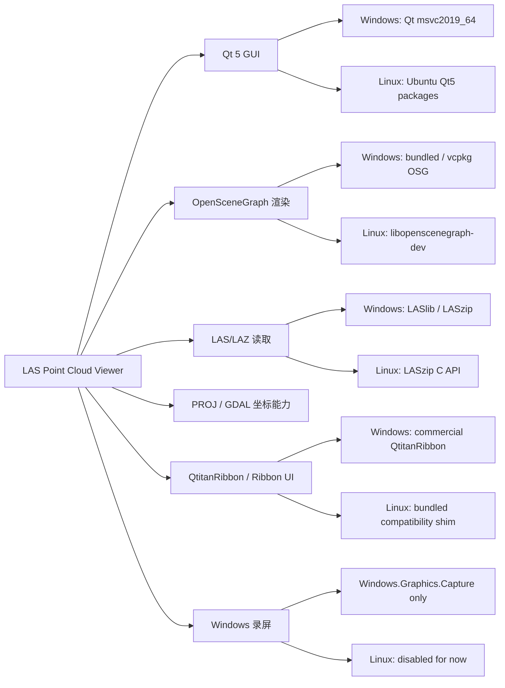
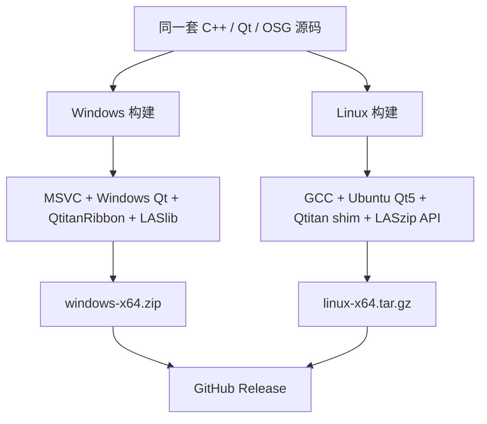

# LAS Point Cloud Viewer Linux 化方案

> 面向纯 Windows 开发者的跨平台改造说明  
> 目标版本：`v1.3.0`  
> 验证环境：Windows 11 + WSL2 Ubuntu 22.04 / Ubuntu 22.04 Desktop  
> 当前状态：Windows 与 Linux 已分平台构建、验证和发布

---

## 0. 先给结论

这个软件可以做成 Linux GUI 客户端，而且已经具备基础 Linux 版本。

它不是“在命令行里跑一个没有界面的程序”，而是在 Linux 桌面环境里打开一个正常的 Qt 图形窗口。对于 Windows 开发者，可以先把它理解成：

| Windows 经验 | Linux / WSL 中对应概念 |
|---|---|
| `.exe` 主程序 | 无扩展名的可执行文件，例如 `LASPointCloudViewer` |
| `.dll` 动态库 | `.so` 动态库，例如 `libqtnribbon4.so` |
| Visual Studio / MSVC | GCC / G++ |
| MSBuild / `.sln` | Ninja / Makefile |
| `C:\`、`E:\` 路径 | `/mnt/c/`、`/mnt/e/` |
| `PATH` 查找 DLL | `LD_LIBRARY_PATH` 查找 `.so` |
| Windows 桌面窗口 | X11 / Wayland 桌面窗口 |
| `windeployqt` 部署 Qt | 系统包安装 Qt，或后续做 AppImage / deb |

本项目的 Linux 化不是推倒重写，而是保留 Qt / CMake / OpenSceneGraph 的主体结构，把 Windows 专属依赖逐步替换成 Linux 可用实现。

---

## 1. 为什么这个软件能有 Linux GUI

本软件的 GUI 基础是 Qt。Qt 本身就是跨平台 GUI 框架，同一套 C++ UI 代码可以分别编译成 Windows 程序和 Linux 程序。

当前项目主要依赖关系如下：



关键点：

- Qt 负责窗口、菜单、dock、表格、按钮、文件对话框。
- OpenSceneGraph 负责点云三维渲染。
- CMake 负责把同一套源码按不同平台配置成不同构建产物。
- Windows 专属能力不强行搬到 Linux，而是通过编译开关关闭或替换。

---

## 2. 推荐目标环境

### 2.1 开发者机器

对从 Windows 起步的开发者，推荐先用 WSL2。

```text
Windows 11
└─ WSL2 Ubuntu 22.04
   ├─ GCC / G++
   ├─ CMake + Ninja
   ├─ Qt 5
   ├─ OpenSceneGraph
   ├─ PROJ / GDAL
   └─ LASzip
```

优点：

- 不需要立刻安装完整 Linux 物理机。
- Windows 文件可以从 Linux 里通过 `/mnt/c`、`/mnt/e` 访问。
- Windows 11 自带 WSLg，Linux GUI 程序可以直接弹出窗口。
- 可以同时保留 Windows 构建链路和 Linux 构建链路。

### 2.2 普通用户机器

发布包当前面向：

```text
Ubuntu 22.04 / WSL2 Ubuntu 22.04
```

Linux 包不是全静态便携包，需要系统先安装 Qt、OSG、PROJ、GDAL、LASzip 等运行库。

---

## 3. 一句话理解 WSL 路径

Windows 文件系统会挂载到 Linux 的 `/mnt` 目录下：

| Windows 路径 | Linux 中看到的路径 |
|---|---|
| `C:\Users\win` | `/mnt/c/Users/win` |
| `E:\code\Project` | `/mnt/e/code/Project` |
| `E:\data\cloud.las` | `/mnt/e/data/cloud.las` |

所以你在 Windows 里已有的点云、航线、工程文件，Linux 程序可以直接打开：

```text
E:\data\powerline.las
```

在 Linux 文件选择器或命令行中就是：

```text
/mnt/e/data/powerline.las
```

> 建议：大点云可以先放在 `/mnt/e` 直接用。若后续遇到超大文件读取性能瓶颈，再考虑复制到 Linux 原生目录，例如 `/home/win/data`。

---

## 4. 已完成的 Linux 化改造

### 4.1 构建系统

项目已支持用 CMake 在 Linux 下配置和编译。

当前 Linux 推荐配置：

```bash
cmake -S . -B out/linux/build -G Ninja \
  -DCMAKE_BUILD_TYPE=Release \
  -DQT_ROOT=/usr \
  -DTHIRDPARTY_ROOT="$PWD/3rd" \
  -DPROJ_ROOT=/usr \
  -DLAS_VIEWER_ENABLE_WINDOWS_CAPTURE=OFF
```

构建：

```bash
cmake --build out/linux/build --target LASPointCloudViewer LASViewerSmokeTest -j 4
```

对应含义：

| 参数 | 作用 |
|---|---|
| `-G Ninja` | 使用 Ninja 生成器，类似 Windows 下选择 VS 生成器 |
| `CMAKE_BUILD_TYPE=Release` | Linux 单配置构建类型 |
| `QT_ROOT=/usr` | 使用 Ubuntu 系统安装的 Qt |
| `THIRDPARTY_ROOT=$PWD/3rd` | 继续使用仓库内第三方资源 |
| `PROJ_ROOT=/usr` | 使用 Ubuntu 系统 PROJ |
| `LAS_VIEWER_ENABLE_WINDOWS_CAPTURE=OFF` | 关闭 Windows 专属录屏后端 |

### 4.2 QtitanRibbon 兼容层

Windows 版本使用原 QtitanRibbon。Linux 下为了避免商业库阻塞构建，项目新增了仓库内兼容层：

```text
tools/linux/qtitan_shim/
```

它提供本项目实际用到的一小部分 QtitanRibbon API，让 Linux 版本可以编译和运行。

需要注意：

- 这是“项目兼容层”，不是完整 QtitanRibbon 替代品。
- 如果未来大量使用 QtitanRibbon 高级功能，兼容层要同步补 API。
- 现阶段目标是保证本项目 Ribbon UI 在 Linux 下可用。

### 4.3 LAS/LAZ 读取路径

Windows 原路径主要依赖 LASlib / LASzip 组合。

Linux 下默认使用系统 LASzip C API：

```text
LAS_VIEWER_ENABLE_LASZIP_API=ON
LAS_VIEWER_ENABLE_LASLIB=OFF
```

这样做的原因：

- Ubuntu 仓库中可以安装 LASzip。
- C API 比把 Windows LASlib 路径硬搬到 Linux 更稳。
- 当前重点是读取 `.las/.laz` 并显示点云。

当前限制：

- Linux 版本重点验证读取和浏览。
- LAS/LAZ 写回能力仍以 Windows LASlib 路径为主。

### 4.4 Windows 录屏能力隔离

项目里的录屏功能依赖：

```text
Windows.Graphics.Capture
D3D11
Media Foundation
```

这些都是 Windows 平台 API，Linux 下不能直接使用。

当前策略：

| 功能 | Windows | Linux |
|---|---|---|
| 内嵌录屏 | 保留 | 暂时关闭 |
| 点云浏览 | 保留 | 支持 |
| 量测 / 净空分析 | 保留 | 支持 |
| 杆塔 / 隐患 | 保留 | 支持 |
| 航线编辑 / QA / 漫游 | 保留 | 支持 |

这种处理方式比强行模拟 Windows API 更可靠。

---

## 5. Linux 开发环境安装

仓库提供了安装脚本：

```bash
bash scripts/linux/setup-ubuntu-22.04.sh
```

它会安装：

| 类别 | 包含内容 |
|---|---|
| 编译器 | `gcc`、`g++`、`build-essential` |
| 构建工具 | `cmake`、`ninja-build` |
| Qt | Qt 5 Widgets / OpenGL / Wayland / XCB |
| 渲染 | OpenSceneGraph、OpenGL、GLU |
| 坐标 | PROJ、GDAL |
| 点云压缩 | LASzip |
| 发布工具 | GitHub CLI `gh` 可另行安装 |

如果你在 WSL 中手动安装，核心命令大致是：

```bash
sudo apt-get update
sudo apt-get install -y \
  build-essential cmake ninja-build pkg-config \
  qtbase5-dev qtbase5-dev-tools libqt5opengl5-dev qttools5-dev-tools \
  qtwayland5 libqt5waylandclient5 libqt5waylandcompositor5 \
  libopenscenegraph-dev libproj-dev libgdal-dev liblaszip-dev \
  libgl1-mesa-dev libglu1-mesa-dev libxkbcommon-x11-0 \
  libxcb-cursor0 libxcb-xinerama0
```

---

## 6. Windows 开发者最容易踩的坑

### 6.1 路径分隔符

不要在代码里硬编码：

```cpp
"E:\\data\\cloud.las"
```

优先使用 Qt 路径类型：

```cpp
QString path = QFileInfo(fileName).absoluteFilePath();
```

或者使用标准库：

```cpp
std::filesystem::path path = inputPath;
```

### 6.2 大小写敏感

Windows 默认文件名大小写不敏感，Linux 敏感。

下面在 Windows 可能没事，在 Linux 会失败：

```cpp
#include "lasreader.h"
```

如果真实文件是：

```text
LasReader.h
```

Linux 必须写成：

```cpp
#include "LasReader.h"
```

### 6.3 动态库加载

Windows 常见部署方式：

```text
LASPointCloudViewer.exe
Qt5Core.dll
Qt5Widgets.dll
...
```

Linux 当前包内结构：

```text
LASPointCloudViewer-v1.3.0-linux-x64/
├─ LASPointCloudViewer
├─ libqtnribbon4.so
├─ run-lasviewer.sh
├─ translations/
└─ README-linux.md
```

启动脚本会设置：

```bash
export LD_LIBRARY_PATH="$PWD:${LD_LIBRARY_PATH:-}"
```

这相当于告诉 Linux：先从当前目录找 `.so`。

### 6.4 编译器更严格

MSVC 能过的代码，GCC 可能会报：

- 头文件缺失
- 类型转换不明确
- 宏冲突
- 未使用变量警告
- 平台 API 不存在

处理原则：

| 问题 | 推荐处理 |
|---|---|
| 缺头文件 | 补标准头，例如 `<algorithm>`、`<limits>` |
| Windows API | 用 `#ifdef _WIN32` 隔离 |
| 路径处理 | 使用 Qt / STL 跨平台 API |
| 第三方库差异 | 在 CMake 中按平台分支 |

---

## 7. 代码改造原则

### 7.1 平台差异放在边界，不要散落全项目

推荐：

```cpp
#ifdef _WIN32
// Windows-specific recorder
#endif
```

但不要到处写零散判断。更好的方式是把平台差异收口到模块边界：

```text
src/capture/
├─ ScreenRecorder.h
├─ WindowsGraphicsCaptureRecorder.cpp
└─ LinuxNoopRecorder.cpp      # 未来可选
```

主业务层只依赖统一接口，不直接关心系统 API。

### 7.2 CMake 做平台分支

推荐把平台差异写进 CMake：

```cmake
if(WIN32)
    target_sources(LASPointCloudViewer PRIVATE
        src/capture/WindowsGraphicsCaptureRecorder.cpp
    )
else()
    target_compile_definitions(LASPointCloudViewer PRIVATE
        LAS_VIEWER_ENABLE_WINDOWS_CAPTURE=0
    )
endif()
```

这样源码结构更清楚，Linux 不会误编 Windows 文件。

### 7.3 先保证核心功能，再补平台特色

Linux 化的优先级建议：

| 优先级 | 内容 | 原因 |
|---|---|---|
| P0 | 能编译、能启动、能打开点云 | 没有这个就谈不上 Linux 版本 |
| P1 | 量测、净空、杆塔、航线核心流程 | 保证产品价值 |
| P2 | 打包、发布、文档、smoke test | 让别人能复现 |
| P3 | Linux 原生录屏、AppImage、deb | 提升体验 |

---

## 8. 构建、运行、测试全流程

### 8.1 配置

```bash
cmake -S . -B out/linux/build -G Ninja \
  -DCMAKE_BUILD_TYPE=Release \
  -DQT_ROOT=/usr \
  -DTHIRDPARTY_ROOT="$PWD/3rd" \
  -DPROJ_ROOT=/usr \
  -DLAS_VIEWER_ENABLE_WINDOWS_CAPTURE=OFF
```

### 8.2 编译

```bash
cmake --build out/linux/build --target LASPointCloudViewer LASViewerSmokeTest -j 4
```

### 8.3 运行

```bash
cd out/linux/build/bin
./LASPointCloudViewer
```

WSLg 下如果窗口显示异常：

```bash
QT_QPA_PLATFORM=wayland ./LASPointCloudViewer
```

### 8.4 冒烟测试

```bash
cd out/linux/build/bin
./LASViewerSmokeTest --mode main-backstage
./LASViewerSmokeTest --mode viewer-render --las ../../../../test_data/ezhou_powerline_sample.las
./LASViewerSmokeTest --mode route-roam --las ../../../../test_data/ezhou_powerline_sample.las
```

通过标准：

| 测试 | 证明什么 |
|---|---|
| `main-backstage` | 主窗口和 Backstage 可初始化 |
| `viewer-render` | 点云渲染链路可用 |
| `route-roam` | 航线漫游相关流程可用 |

---

## 9. 发布打包方案

### 9.1 Windows 包

Windows 使用现有脚本：

```powershell
.\scripts\package_release.ps1 `
  -Version v1.3.0 `
  -Config Release `
  -BuildBinDir out/build/bin/Release `
  -OutputDir out/release
```

产物：

```text
out/release/LASPointCloudViewer-v1.3.0-windows-x64.zip
```

### 9.2 Linux 包

Linux 使用新增脚本：

```bash
bash scripts/linux/package-release.sh \
  v1.3.0 \
  out/linux/build/bin \
  out/release
```

产物：

```text
out/release/LASPointCloudViewer-v1.3.0-linux-x64.tar.gz
```

包内结构：

```text
LASPointCloudViewer-v1.3.0-linux-x64/
├─ LASPointCloudViewer
├─ libqtnribbon4.so
├─ run-lasviewer.sh
├─ setup-ubuntu-22.04.sh
├─ README-linux.md
└─ translations/
   └─ lasviewer_zh_CN.qm
```

### 9.3 GitHub Release

发布页：

```text
https://github.com/hikki1998/PointcloudViewer/releases/tag/v1.3.0
```

发布附件：

```text
LASPointCloudViewer-v1.3.0-windows-x64.zip
LASPointCloudViewer-v1.3.0-linux-x64.tar.gz
```

本机 WSL 已安装 GitHub CLI：

```bash
gh --version
```

如果需要持久登录：

```bash
gh auth login
```

注意：持久登录需要 GitHub token 具备 GitHub CLI 要求的权限 scope。当前发布已通过已有 GitHub 凭据完成，后续可以再补一个专用 PAT。

---

## 10. 面向另一台 Linux 设备的编译说明

如果在另一台 Ubuntu 22.04 设备上拉代码：

```bash
git clone https://github.com/hikki1998/PointcloudViewer.git
cd PointcloudViewer
git checkout v1.3.0
```

安装依赖：

```bash
bash scripts/linux/setup-ubuntu-22.04.sh
```

配置：

```bash
cmake -S . -B out/linux/build -G Ninja \
  -DCMAKE_BUILD_TYPE=Release \
  -DQT_ROOT=/usr \
  -DTHIRDPARTY_ROOT="$PWD/3rd" \
  -DPROJ_ROOT=/usr \
  -DLAS_VIEWER_ENABLE_WINDOWS_CAPTURE=OFF
```

编译：

```bash
cmake --build out/linux/build --target LASPointCloudViewer LASViewerSmokeTest -j 4
```

验证：

```bash
cd out/linux/build/bin
./LASViewerSmokeTest --mode main-backstage
./LASViewerSmokeTest --mode viewer-render --las ../../../../test_data/ezhou_powerline_sample.las
./LASViewerSmokeTest --mode route-roam --las ../../../../test_data/ezhou_powerline_sample.las
```

运行：

```bash
./LASPointCloudViewer
```

---

## 11. 后续演进路线

### 阶段 1：当前已完成

| 项目 | 状态 |
|---|---|
| Linux CMake 配置 | 已完成 |
| Linux 编译 | 已完成 |
| Linux GUI 启动 | 已完成 |
| Linux LAS/LAZ 读取 | 已完成 |
| QtitanRibbon Linux 兼容层 | 已完成 |
| Windows / Linux 分平台打包 | 已完成 |
| GitHub Release 附件发布 | 已完成 |

### 阶段 2：建议下一步

| 方向 | 价值 |
|---|---|
| 增加 Linux CI | 每次提交自动验证 Linux 构建 |
| 增加 AppImage | 用户下载后更接近双击运行 |
| 增加 `.deb` 包 | 更符合 Ubuntu 软件分发习惯 |
| Linux 原生录屏 | 补齐 Windows 录屏差异 |
| 扩展 Linux smoke test | 覆盖更多业务流程 |

### 阶段 3：更长期

| 方向 | 说明 |
|---|---|
| Qt 6 迁移评估 | Qt 5 长期维护压力会增加 |
| Wayland 适配增强 | Linux 桌面正在从 X11 转向 Wayland |
| GPU/驱动兼容矩阵 | 针对 Intel / NVIDIA / AMD 验证 |
| 更完整的运行时打包 | 减少用户安装系统依赖的步骤 |

---

## 12. 判断 Linux 版本是否“合格”的清单

每次发布 Linux 版本前建议检查：

- [ ] Ubuntu 22.04 能重新配置 CMake
- [ ] `LASPointCloudViewer` 能编译成功
- [ ] `LASViewerSmokeTest` 能编译成功
- [ ] `main-backstage` 通过
- [ ] `viewer-render` 通过
- [ ] `route-roam` 通过
- [ ] GUI 能在 WSLg 或 Ubuntu 桌面打开
- [ ] 能打开 `/mnt/e/...` 下的 Windows 点云文件
- [ ] Linux 包内包含 `run-lasviewer.sh`
- [ ] Linux 包内包含 `libqtnribbon4.so`
- [ ] Linux 包内包含中文翻译 `.qm`
- [ ] Release 页面同时上传 Windows zip 和 Linux tar.gz
- [ ] 发布说明明确列出 Linux 限制

---

## 13. 最小心智模型

如果只记住一张图，可以记这张：



Linux 化的本质不是把 Windows 搬进 Linux，而是让项目的核心业务代码继续共用，把平台差异放到依赖、构建和少数平台模块里。

---

## 14. 相关文件索引

| 文件 | 作用 |
|---|---|
| `docs/linux-build.md` | Linux 构建和运行命令 |
| `scripts/linux/setup-ubuntu-22.04.sh` | Ubuntu 依赖安装 |
| `scripts/linux/build-qtitan-shim.sh` | Qtitan 兼容层独立构建 |
| `scripts/linux/package-release.sh` | Linux 发布包生成 |
| `tools/linux/qtitan_shim/` | Linux QtitanRibbon 兼容层 |
| `CMakeLists.txt` | 顶层构建入口和平台开关 |
| `cmake/LASViewerDependencies.cmake` | 依赖探测 |
| `src/pointcloud/LasReader.cpp` | LAS/LAZ 读取平台差异 |
| `src/capture/` | Windows 录屏平台相关代码 |
| `docs/releases/v1.3.0.md` | 当前跨平台版本发布说明 |

---

## 15. 给 Windows 开发者的迁移建议

先不要试图一次理解所有 Linux 细节。最稳的学习路径是：

1. 先用 WSL 打开项目目录。
2. 跑通 `setup-ubuntu-22.04.sh`。
3. 跑通 CMake 配置。
4. 跑通 Linux 编译。
5. 跑通 3 个 smoke test。
6. 用 `/mnt/e/...` 打开一个 Windows 里的 LAS 文件。
7. 再回头看 CMake 里的平台分支。
8. 最后再研究 `.so`、`LD_LIBRARY_PATH`、AppImage、deb 等发布细节。

这样学 Linux 不会变成“从操作系统原理开始补课”，而是围绕这个项目逐步建立直觉。
